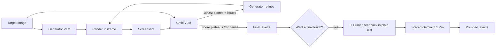
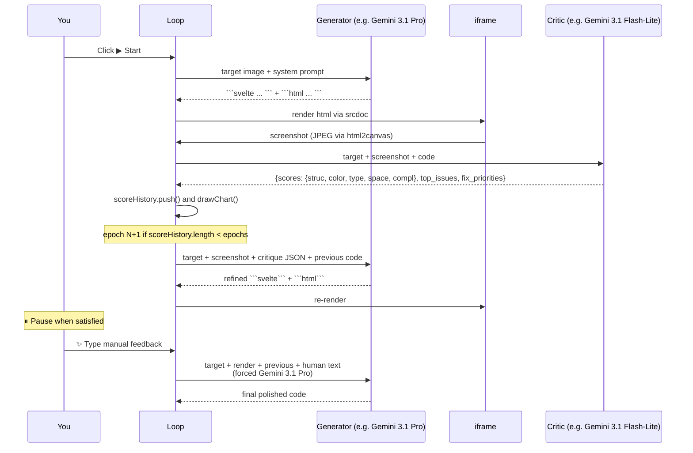
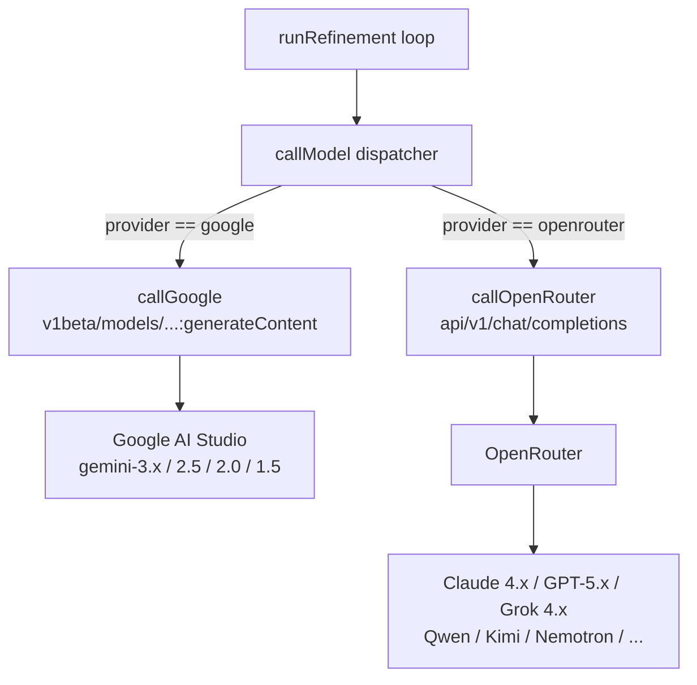
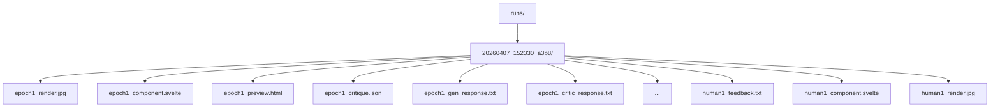

# 🔥 game-ui-refiner

> **Iteratively refine AI-generated game UIs into pixel-faithful Svelte components, using a vision critic + code generator loop.**

[](LICENSE)
[](#quickstart)
[](src/)
[](tests/run.mjs)
[](CONTRIBUTING.md)

A pure-browser tool that takes a **screenshot of a game UI** you want to replicate and runs an iterative loop where:

1. A **generator VLM** writes a Svelte component + standalone HTML preview
2. The browser **renders** the HTML in a sandboxed iframe and captures a screenshot
3. A **critic VLM** compares (target, render) and emits a structured JSON critique
4. The generator gets the critique and produces a refined version
5. Repeat until you pause and apply your own **manual feedback** for the final touch

No Webpack, no Vite, no React, no Svelte (the irony). One HTML file + a tiny Python server + a handful of compiled TS modules. Open a browser tab and you're refining.

---

## The problem

You ask Claude/GPT/Gemini for a Svelte game UI component from a reference image and you get this:

```
target:           ┃ what the LLM gives you:
                  ┃
[ ⏸ ▶ ▶▶ ◆ ]      ┃  [pause][play][>>][x]
 ↑ bevels         ┃   ↑ flat
 ↑ gradients      ┃   ↑ no gradients
 ↑ pixel detail   ┃   ↑ generic Tailwind
```

The model knows *what* a button bar looks like, but it can't see its own output to verify if the bevels match, the gradient is right, the spacing is exact. So you iterate manually for an hour.

This tool **closes the loop**: the model sees the target, generates code, the browser renders it, a *different* VLM compares the render to the target and emits structured feedback, and the generator iterates. After 4-5 epochs you get something that actually looks like the target.

---

## How it works



The architecture is heavily inspired by **GameUIAgent** (the 6-stage pipeline + 5 quality dimensions for the critic), **UI2Code^N** (the iterative drafting/polishing paradigm), **VisRefiner** (the diff-aligned learning approach), and **AutoGameUI** (the separation of UI artist concerns from UX functional concerns). See [Related work](#related-work) below for citations.

### Per-epoch sequence



### Provider abstraction



### File save layout per session



---

## Quickstart

```bash
git clone https://github.com/GeraCollante/game-ui-refiner
cd game-ui-refiner

# Get a free Gemini API key at https://aistudio.google.com/app/apikey
cp .env.example .env
$EDITOR .env  # paste your key into GEMINI_API_KEY=AIza...

python3 serve.py
# → http://localhost:8000
```

That's it. **No `npm install` for end users** — the compiled JS is committed in `js/`.

In the browser:

1. The default provider is 🟦 Google Direct, the default preset is 🥇 Smart (Gemini 3.1 Flash-Lite as critic + Gemini 3.1 Pro as generator)
2. Drop, paste, or click to upload your **target image**
3. Set epochs (default 4) and click **▶ Start**
4. Watch the score chart climb across epochs
5. Click **⏸ Pause** when it converges
6. Optionally type a feedback line and click **✨ Aplicar feedback** for the final touch with Gemini 3.1 Pro
7. Copy the Svelte from the **📦 Svelte** tab into your project

---

## Models supported

| Family | Provider | Models | Vision |
|---|---|---|---|
| Gemini 3.x | Google direct + OpenRouter | 3.1 Pro, 3.1 Flash-Lite, 3 Pro, 3 Flash | ✅ |
| Gemini 2.5 | Google direct + OpenRouter | 2.5 Pro, 2.5 Flash, 2.5 Flash-Lite | ✅ |
| Gemini 1.5/2.0 | Google direct | 2.0 Flash, 1.5 Pro/Flash | ✅ |
| GPT-5.x | OpenRouter | 5.4, 5.4 mini, 5 | ✅ |
| Claude 4.x | OpenRouter | Sonnet 4.6, Opus 4.6, Haiku 4.5 | ✅ |
| Grok 4.x | OpenRouter | 4.20 (2M ctx), 4.20 multi-agent, 4 Fast, 4 | ✅ |
| Qwen 3.5 | OpenRouter | 397B A17B | ✅ |
| Kimi K2.5 | OpenRouter | K2.5 | ✅ |
| Nemotron | OpenRouter | Nano 12B VL (+ `:free` variant) | ✅ |
| Llama 4 | OpenRouter | Maverick | ✅ |

For up-to-date pricing and benchmarks, see [Artificial Analysis](https://artificialanalysis.ai).

---

## Presets

| Preset | Critic | Generator | Cost / 4-epoch run | Notes |
|---|---|---|---|---|
| 🥇 **Smart** (default) | Gemini 3.1 Flash-Lite | Gemini 3.1 Pro | ~$0.04 | Best balance |
| 🥈 Smart-3 | Gemini 3 Flash | Gemini 3.1 Pro | ~$0.05 | If 3.1 Flash-Lite hallucinates |
| ⚡ Speed | Gemini 3.1 Flash-Lite | Gemini 3 Flash | ~$0.02 | Iterate prompts fast |
| 👑 Premium | Gemini 3.1 Pro | Gemini 3.1 Pro | ~$0.10 | Maximum quality |
| 🪨 Stable | Gemini 2.5 Flash | Gemini 2.5 Pro | ~$0.04 | Free tier friendly |
| 🅰️ Anthropic *(OR only)* | Gemini 3.1 Flash-Lite | Claude Sonnet 4.6 | ~$0.10 | A/B test Claude |
| 🤖 Grok *(OR only)* | Grok 4 Fast | Grok 4.20 | ~$0.04 | Top non-hallucination + IFBench |
| 🤖 Grok Full *(OR only)* | Grok 4.20 | Grok 4 | ~$0.12 | Premium Grok stack |
| 🆓 Free | Gemini 2.5 Flash | Gemini 2.5 Flash | $0 | Free tier (15 RPM) |

The **Manual Feedback** button always uses **Gemini 3.1 Pro** regardless of the active preset, because for final touch-ups you want the strongest model and cost is irrelevant.

---

## Cost

A typical run with the Smart preset is ~**$0.04 for 4 epochs** (Google direct pricing). The Premium preset is ~**$0.10**. The Free preset is ~**$0** if you stay within Gemini's 1000 requests/day free tier.

The header shows live cost and wall-clock time. Both reset on each run.

---

## Architecture details for the curious

### Why dual output (Svelte + HTML preview)?

Browsers can't render `.svelte` files natively without a compiler. So the generator emits **two blocks per response**:
- A `.svelte` component (the deliverable)
- A self-contained HTML preview (visually identical, used for the iframe rendering and the screenshot loop)

The two stay in sync because the same model emits both in one go.

### Why JPEG screenshots instead of PNG?

JPEG quality 0.85 is **5–10× smaller** than PNG for typical UI screenshots and visually indistinguishable for fidelity comparison. The savings compound across epochs (each epoch sends 1-2 screenshots in API requests).

### Why is the Prompts panel "lazy"?

The Prompts panel renders inline base64 image thumbnails, which Firefox decodes and keeps in RAM. Refreshing it on every API call (instead of only when you click the tab) was a Firefox memory hog. Now it's marked dirty and only rebuilt when you actually view it.

### Why a static analyzer?

Because we kept getting bitten by these specific bugs:
1. **Stray `</script>` in JS strings** — kills the inline script tag (the HTML parser doesn't understand JS)
2. **Recursive function calls** introduced by typos in dispatcher branches
3. **DOM ID references** that drift from declared `id="..."` attributes after refactors

`tools/check.mjs` parses every compiled `js/*.js` with **acorn**, runs **Tarjan SCC** over the call graph for indirect cycles, and cross-checks DOM IDs declared in HTML against `$('foo')` references in JS. Run it with `npm run check` or as part of `npm run lint`.

---

## Project layout

```
game-ui-refiner/
├── index.html                    # ~220 lines: just markup, loads ./js/main.js as type=module
├── serve.py                      # ~150 lines: tiny Python server, .env injection, /save endpoint
├── src/                          # TypeScript source (edit these)
│   ├── types.ts                  # interfaces shared across modules
│   ├── state.ts                  # global mutable state
│   ├── config.ts                 # model catalogs, presets, dim colors
│   ├── parser.ts                 # pure functions: parseDualOutput, extractJson, etc
│   ├── api.ts                    # provider clients + message builders + screenshot
│   ├── ui.ts                     # tabs, chart, history, ticker, save, log, dropdowns
│   └── main.ts                   # entry: runRefinement, runFeedbackEpoch, init
├── js/                           # compiled output (committed, no npm install needed)
├── tests/run.mjs                 # 38 plain-Node parser tests (no jest/vitest)
├── tools/
│   ├── check.mjs                 # static analyzer (acorn + Tarjan SCC + DOM crosscheck)
│   ├── lint.sh                   # full pipeline: tsc + check + tests + ruff
│   └── README.md
├── .github/workflows/check.yml   # CI: lint + tests + serve.py smoke test
├── .env.example
├── tsconfig.json
├── package.json
├── README.md
├── CONTRIBUTING.md
├── CHANGELOG.md
└── LICENSE
```

---

## Development

```bash
# Install dev deps (TypeScript + acorn for the analyzer)
npm install
cd tools && npm install && cd ..

# Edit src/*.ts, then build
npm run build      # one-shot
npm run watch      # auto-recompile

# Run all checks
npm run lint
```

The full pipeline that CI runs is in `tools/lint.sh`:

1. `npx tsc --noEmit` — type-check
2. `node tools/check.mjs` — static analyzer
3. `node tests/run.mjs` — parser unit tests
4. `ruff check serve.py` — Python lint

---

## Roadmap

- [ ] Smoke tests with headless Chromium (Playwright) to detect runtime regressions
- [ ] Multi-target batch mode: process N images in series, save to one session folder
- [ ] Export entire run as a self-contained zip (target + all epochs + final code + critique JSONs)
- [ ] Output target formats beyond Svelte: React component, Vue SFC, plain HTML+CSS
- [ ] Visual diff tab between any two epochs
- [ ] More providers: Anthropic Direct, AWS Bedrock, Azure OpenAI
- [ ] Configurable critic schema (currently hardcoded to GameUIAgent's 5 dimensions)

---

## Related work

This project would not exist without the following papers. None of their code is reused — the inspiration is conceptual, not literal.

- **GameUIAgent** ([arXiv:2603.14724](https://arxiv.org/abs/2603.14724)) — *An LLM-Powered Framework for Automated Game UI Design with Structured Intermediate Representation* (2026). Source of the 6-stage pipeline pattern and the 5 quality dimensions used by the critic (`structural_fidelity`, `color_consistency`, `typography`, `spacing_alignment`, `visual_completeness`). Also the inspiration for the Reflection Controller pattern.
- **UI2Code^N** ([arXiv:2511.08195](https://arxiv.org/abs/2511.08195)) — *A Visual Language Model for Test-Time Scalable Interactive UI-to-Code Generation* (Tsinghua/Zhipu, 2025). Validates the iterative drafting → polishing paradigm we apply across epochs. Their 9B model establishes that loop-based refinement matters more than raw model size.
- **VisRefiner** ([arXiv:2602.05998](https://arxiv.org/abs/2602.05998)) — *Learning from Visual Differences for Screenshot-to-Code Generation* (CAS, 2026). The conceptual basis for the diff-driven critique format and the truncation detection in the parser.
- **AutoGameUI** ([arXiv:2411.03709](https://arxiv.org/abs/2411.03709)) — *Constructing High-Fidelity GameUI via Multimodal Correspondence Matching* (Tencent TiMi, 2026). The clearest articulation of why UI design and UX function should be separated, which inspired the critic/generator split here.
- **Design2Code** ([arXiv:2403.03163](https://arxiv.org/abs/2403.03163)) — *Benchmarking Multimodal Code Generation for Automated Front-End Engineering* (Stanford, NAACL 2025). The benchmark methodology for evaluating image-to-code fidelity and the source of our intuition that vision benchmarks lie about real performance.
- **Reflexion** ([arXiv:2303.11366](https://arxiv.org/abs/2303.11366)) and **Self-Refine** ([arXiv:2303.17651](https://arxiv.org/abs/2303.17651)) — Foundational papers on LLM self-critique and iterative refinement loops.

---

## License

MIT — see [LICENSE](LICENSE).

## Acknowledgments

Built in a single conversation with [Claude Code](https://github.com/anthropics/claude-code) (Opus 4.6 with 1M context). The TypeScript split, the analyzer, the test suite, the README, and most of the system prompt engineering were iterated end-to-end with the model in the loop. The architectural decisions (split critic/generator, lazy DOM, JPEG screenshots, Tarjan-based recursion detection, parser strategies for messy LLM output) emerged from real failures during development.

Citations to all the related papers above. Special mention to **GameUIAgent** as the conceptual seed.
